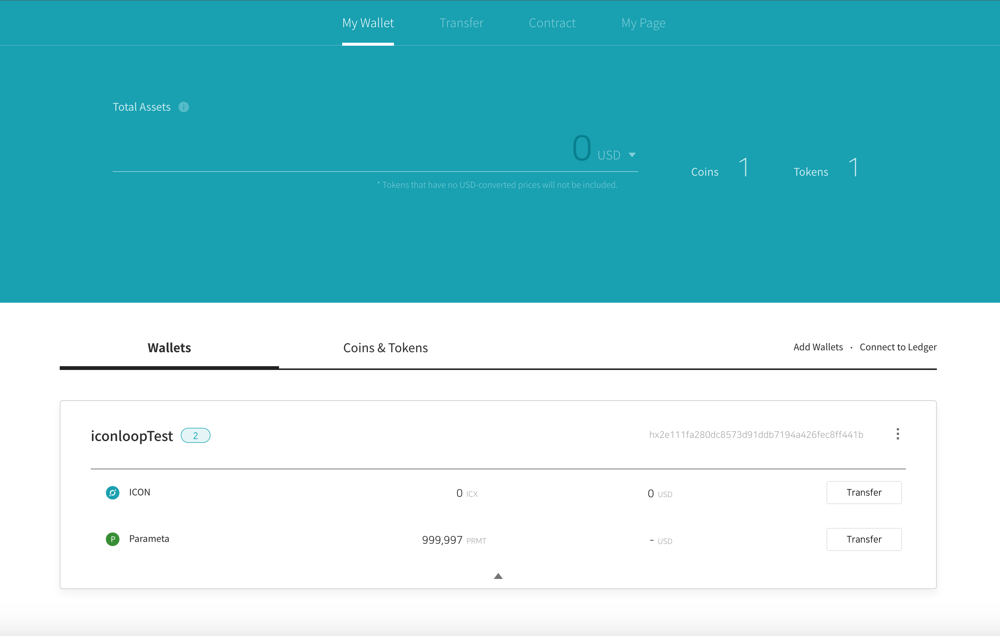

# ICONSDK Wallet
> ICONSDK Wallet Desktop version (Chrome extension)

ICONSDK Wallet where you can keep not only ICX but also other various crypto-currencies.



## Development Setup

##### Install Modules

You can install modules with npm (Node.js v7.10 or later, LTS recommended):

```sh
# Install dependencies
npm install
```

##### Run development mode:

```sh
# build files to './build-test'
# build app continuously
npm run dev
```

> ICONSDK Network: dev (https://lisbon.net.solidwallet.io)  

[Load unpacked extensions](https://developer.chrome.com/extensions/getstarted#unpacked) with `./build-test` folder.


##### Run redux-devtools for debug :
```sh
npm run remotedev
```
Then, open `http://localhost:8000`.


## Build

##### Run build:

```sh
# build files to './build'
npm run build
```

> ICONSDK Network: default (wallet.icon.foundation) 
